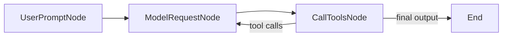

<div align="center">

# SwiftAgentSDK

### Typed, model-agnostic LLM agents in pure Swift.

A faithful Swift port of Python's [pydantic-ai](https://github.com/pydantic/pydantic-ai) — agents, tools, structured output, streaming, and a graph-based run engine — for Apple platforms, built on **FoundationModels**.

[](https://swift.org)
[](#)
[](#installation)
[](#build--test)
[](LICENSE)

Anthropic Claude · OpenAI · Google Gemini · Apple on-device — one API.

</div>

---

**SwiftAgentSDK** lets you build AI agents — LLM calls plus typed tools, structured output, and a self-correcting run loop — through one provider-agnostic API. Rather than reimplementing Pydantic's runtime schema engine, it reuses Apple's **FoundationModels** (`@Generable` / `GenerationSchema` / `GeneratedContent`) as the schema substrate to drive both the on-device Apple model and remote providers.

```swift
import AgentKit

let agent = Agent<Void, String>(
    AnthropicModel(model: "claude-sonnet-4-6"),
    instructions: "Be concise.")

let result = try await agent.run("Where does \"hello world\" come from?")
print(result.output)
```

## Why SwiftAgentSDK

- **Typed end-to-end.** `Agent<Deps, Output>` is generic over your dependencies and a `@Generable` output type — no stringly-typed JSON wrangling.
- **Model-agnostic.** Swap Claude, GPT, Gemini, or the Apple on-device model behind one `ModelProtocol`. `"provider:model"` selectors included.
- **Tools with dependency injection.** Register closures or types; they run in parallel and receive a `RunContext` carrying your `deps`.
- **Structured output, four ways.** Plain text, forced output-tool, provider-native JSON schema, or prompted — selected automatically per model.
- **Self-correcting.** Tools and validators throw `ModelRetry`; the loop re-prompts within a bounded budget.
- **Streaming.** Text and reasoning deltas, plus typed partial snapshots of the structured output as it is generated.
- **Graph run engine.** The loop is a real state machine you can observe and step through node-by-node via `iter()`.
- **Testable offline.** `TestModel`, `FunctionModel`, `ScriptedStreamModel`, and `FallbackModel` let the full suite run with no network and no device.

## Providers

| Provider | Model API | Structured output | Streaming | Multimodal |
|---|---|---|---|---|
| Anthropic Claude | Messages API | output-tool | SSE | image, document |
| OpenAI | Chat Completions | native (strict JSON schema) | SSE | image, audio, file |
| Google Gemini | `generateContent` | native (OpenAPI subset) | SSE | inline, file data |
| Apple on-device | FoundationModels | native | text deltas | text only |

## Installation

Add the package to your `Package.swift`:

```swift
dependencies: [
    .package(url: "https://github.com/f3xp/swift-agent-sdk.git", from: "0.1.0")
]
```

Then depend on the umbrella module, or pick individual provider targets to keep your binary lean:

```swift
.target(name: "MyApp", dependencies: [
    .product(name: "AgentKit", package: "swift-agent-sdk")
])
```

## Quick start

```swift
// Structured output — any @Generable type
@Generable struct CityLocation {
    @Guide(description: "The city") var city: String
    @Guide(description: "The country") var country: String
}

let agent = Agent<Void, CityLocation>(AnthropicModel(model: "claude-sonnet-4-6"))
let r = try await agent.run("Where were the 2012 Olympics held?")
print(r.output.city, r.output.country)   // London United Kingdom
```

```swift
// On-device (no keys, no network)
let agent = Agent<Void, CityLocation>(AppleModel())
let r = try await agent.run("What is the capital of France?")
```

```swift
// Dependencies + tools + structured output
struct Deps: Sendable { let customerID: Int; let db: DatabaseConn }
@Generable struct Support { var advice: String; var blockCard: Bool; var risk: Int }

let agent = Agent<Deps, Support>(AnthropicModel(model: "claude-sonnet-4-6"))
    .instructions("You are a bank support agent.")
    .tool("balance", "Get the customer balance.") { (args: BalanceArgs, ctx) in
        ToolResult("\(await ctx.deps.db.balance(ctx.deps.customerID))")
    }
let r = try await agent.run("What's my balance?", deps: Deps(customerID: 1, db: db))
```

```swift
// "provider:model" selectors
registerBundledProviders()
let agent = try Agent<Void, String>(ModelSelector("anthropic:claude-sonnet-4-6"))
```

## The run is a graph

Every run executes as an explicit state machine on the built-in **AgentGraph** engine (a Swift port of `pydantic_graph`):



`run()` and `runStream()` drive this graph for you. When you need to observe or steer it, use `iter()` to walk the run node-by-node and stream any node before the run advances past it:

```swift
let run = try agent.iter("Where were the 2012 Olympics held?")
for try await node in run {
    switch node {
    case .userPrompt:           print("prompt")
    case .modelRequest(let s):  for try await ev in s.events() { /* deltas, partials */ }
    case .callTools:            print("handling response")
    case .end(let result):      print("done:", result.output)
    }
}
```

`AgentGraph` is a standalone, reusable target: build your own typed asynchronous state machines with `GraphNode` / `Graph` / `GraphRun`, complete with mermaid export and a persistence seam.

## Architecture

```
AgentCore        schema bridge, ModelMessage (request/response split), Usage, errors, ModelProtocol/ModelProfile
AgentGraph       generic async state-machine engine (GraphNode / Graph / GraphRun, mermaid, persistence seam)
Agents           Agent<Deps,Output> (Sendable struct, value-semantics builders), RunContext, the graph-based run loop, iter()
AgentHTTP        shared SSE parser + retry/backoff
AgentApple       FoundationModels on-device (only target importing the session APIs)
AgentAnthropic   Messages API           (+ offline-tested wire translation)
AgentOpenAI      Chat Completions + native structured output + strict-schema normalization
AgentGoogle      Gemini generateContent + native structured output + OpenAPI-subset normalization
AgentTestSupport TestModel / FunctionModel / ScriptedStreamModel / FallbackModel
AgentKit         umbrella re-export + registerBundledProviders()
```

## Roadmap

Completed: vertical slice, message-model realignment, provider breadth and streaming, and the graph engine with `iter()`. Upcoming work is tracked as [issues](https://github.com/f3xp/swift-agent-sdk/issues):

- W3 — Toolset abstraction and an MCP client (`AgentMCP`)
- W4 — RunContext enrichment, evaluations (`AgentEvals`), and OpenTelemetry observability
- Deferred — Apple on-device native streaming; durable graph persistence and resume

## Build & test

```sh
swift build
swift test                   # 75 tests, fully offline
swift run Examples iter      # live: requires ANTHROPIC_API_KEY
swift run Examples hello
swift run Examples city
swift run Examples support
```

## License

[MIT](LICENSE) © 2026 f3xp
